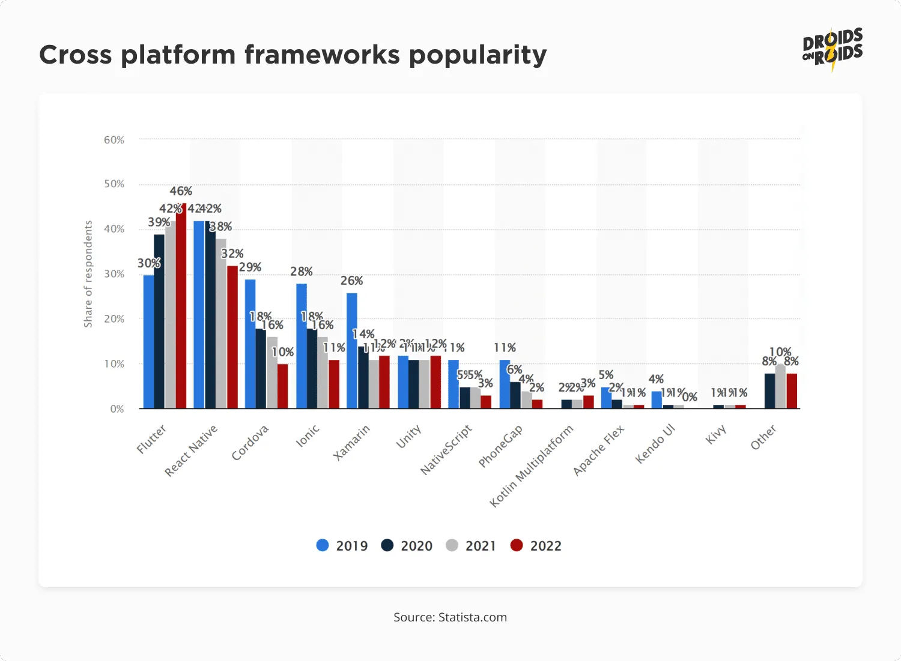

#thought #flutter
# Flutter의 미래에 대한 생각

최근 Flutter에 흥미가 생겨서 조금씩 공부를 하고 있다.

Flutter는 현재 가장 주목받는 미래의 크로스 플랫폼 앱 프레임워크이며,

안드로이드, iOS, 윈도우, 리눅스, macOS, Web(현재는 매우 제한적), 임베디드 등, 다양한 환경에서 동작하는 어플리케이션을 하나의 코드 베이스로 만들 수 있다는 것과, 세계 최고의 기업 중 하나인 구글이 뒤를 봐준다는 것이 매력으로 다가왔다.

Flutter에 사용되는 언어인 `Dart`와 미래의 OS `Fuchsia`에 대한 간단한 개요를 알아보고, 왜 Flutter가 미래인지에 대한 생각을 남겨두려고 한다.

# Dart

Dart는 2011년 공개되었으며, 처음에는 문제가 많던 JS를 대체할 목적이었으나, 알다시피 현재 그 포지션은 TypeScript가 지배적이고, Dart는 완전히 망했었다.

그러나 2017년 Flutter가 출시된 이후 Dart도 함께 떠오르고 있으며, TypeScript처럼 범용적인 언어가 아니라, 오직 Flutter를 위한 전용 언어가 되어가고 있으며, 실제로 Flutter, Dart 팀이 활발하게 협업하고 있다고 한다.

그래서 온갖 용도로 사용되는 JS와 달리, Dart는 Flutter의 요구 사항에 맞춰 업데이트 및 최적화 할 수 있다는 장점을 갖는다.
그러나 이는 반대로 말하면 범용성이 떨어진다는 단점이라 볼 수도 있다.

문법은 Java와 유사한 부분이 많고, 본디 웹 개발을 위해 만들어졌기 때문에 호환을 위해 JavaScript와 닮은 부분도 있어서 프론트, 백 개발자 모두 쉽게 익힐 수 있다.

Managed Language기 때문에 JVM과 유사한 DVM이라는 가상 머신 상에서 동작하며, JIT, AOT 컴파일러가 모두 지원되기 때문에, 배포 시에는 전체 코드를 컴파일하지만(AOT), 개발 시에는 실행하는 부분만 컴파일하여(JIT) 마치 웹 개발을 하는 것처럼 변경 사항을 바로 화면에 반영해주는 Hot Reloading도 매우 깔끔하게 지원한다.

Flutter를 하다가 안드로이드, iOS 개발로 넘어간다면, 이 부분이 상당히 큰 역체감으로 다가올 것이라고 생각된다.

---

# Fuchsia

퓨시아 혹은 푸크시아라고 부르는 구글에서 개발 중인 미래의 OS다.

프로그래밍을 공부하기 이전에도 전자기기에 관심이 많아서 IT 뉴스에 관심을 갖고 지켜봤었는데, 2016년 경, 퓨시아에 대한 루머를 처음 접하게 되었다.

그리고 작년엔 Fuchsia가 갤럭시에 들어간다는 루머를 들었는데,

애플이 직접 개발한 칩이 맥북에 들어간다는 루머가 떠돈지 수년 뒤에 그것이 현실이 되었던 것처럼, 이것도 차후 현실이 될 것이라고 생각하고 있다.

개인적으로 생각해본 이유를 간단하게 나열하면,

우선 안드로이드는 리눅스 커널 기반이기 때문에 리눅스에 의존적이다.

리눅스는 모놀리틱 커널이기 때문에 OS의 모든 핵심 기능이 하나의 이미지에 통합되고, 이 때문에 커널 규모가 커질수록 유지보수가 어려워지고 확장성이 제한된다고 한다.

스마트폰에 들어가기에는 너무 비대한 OS인 것인데, 구글이 원하는 것은 스마트폰, 스마트 워치, 자율 주행차, 각종 IOT 기기 등 모든 기기에 사용할 수 있는 하나의 OS라고 생각한다.

리눅스를 기본으로 깔고 가면 커널 모드로 호출되는 코드만 수 천만 줄로, 너무 비대하기 때문에 비효율적이다.

퓨시아에 탑재될 마이크로 커널인 지르콘을 도입하면, 커널은 핵심 기능만 갖추고 있기 때문에 훨씬 가볍고, 각 기기에 따라 필요한 부분만을 조합해서 사용할 수 있기 때문에 커스터마이징에 훨씬 유리해진다.

또한 각 어플리케이션을 별도의 샌드박스 환경에서 실행하여 다른 어플리케이션에 의한 손상을 방지할 수 있어서 보안도 더 뛰어나다.

물론 트레이드 오프도 존재한다.
마이크로 커널은 컨텍스트 스위칭이 더 자주 발생하여 성능 손실이 존재한다고 한다.

정리하면 리눅스는 훌륭한 OS지만 다양한 종류의 기기에 대응하기엔 적절하지 않기 때문에 마이크로 커널을 개발할 필요가 있다.

안드로이드도 훌륭한 OS지만 운영체제 자체가 한 번 만들어지면 수 십년 이상 유지보수가 발생하고, 수 십년 이상을 더 편하게 개발할 수 있다는 것은 엄청난 비용 절약이 될 것이기 때문에 매우 큰 이점이라고 생각한다.

마지막으로 구글이 직접 만든 OS기 때문에, 애플과 마찬가지로 하드웨어, 소프트웨어를 동시에 만들 수 있다는 이점도 있다.

OS에 최적화 된 커스텀 칩을 설계할 수 있기 때문에 훨씬 더 섬세한 최적화가 가능할 것이라고 생각된다.

OS와 하드웨어에 대해 깊게 알지는 못하지만, 내가 아는 지식 내에서 생각해보면 이 정도가 생각난다.

## Flutter와 Fuchsia의 미래

앞서 살펴봤던 것처럼 Fuchsia는 다양한 기기에 하드웨어, 소프트웨어가 모두 최적화 된 형태로 적용될 수 있다.

그러나 문제는 생태계다.

아무리 좋은 게임이 있더라도, 컨텐츠가 적으면 금방 모든 컨텐츠를 소비하고 더는 플레이 하지 않게 될 것이다.

페이스북, 카카오톡도 마찬가지로 다른 메신저에 비해 엄청나게 월등해서 사용하는 것이 아니라, 사용자가 많기 때문에 사용하는 것이다.

즉, 생태계가 전혀 없는 신생 OS라는 것이 Fuchsia의 최대 단점이라고 볼 수 있다.

구글도 당연히 이러한 문제점을 오래전부터 인지하고 있었기 때문에 퓨시아에서 안드로이드 앱을 지원할 계획을 세우고 있었던 것으로 보인다.

https://zdnet.co.kr/view/?no=20190104091204

이는 마치 macOS의 로제타와 비슷한 느낌이다.
M1 맥북에서도 초창기에 모든 프로그램이 인텔 기반으로 설계되었기 때문에, M1 맥북에 맞춰서 변환해주는 기능을 지원했으며, 이 덕분에 프로그램을 M1 기반에 맞춰 새로 만들지 않더라도 임시 방편으로 대부분의 프로그램을 그대로 사용할 수 있었다.

그러나 이는 말 그대로 임시 방편이기 때문에, 언젠가는 바뀌어야 하는 것이었다.

M1 출시로부터 4년이 다 되가는 지금은 대부분의 프로그램이 인텔이 아닌 M1 기반으로 재작성되었다.

충분한 기간과 대안이 주어졌기 때문에 큰 불편함 없이 수많은 프로그램이 마이그레이션 될 수 있었던 것이다.

물론 이런 방식도 괜찮지만,
구글은 좀 더 큰 그림을 그리는 것으로 보여진다.

그 과정에서 나온 것이 Flutter라고 생각한다.

크로스 플랫폼 프레임워크.

하나의 코드 베이스로 안드로이드, iOS, Windows, macOS, linux, 임베디드, 웹까지.

거의 모든 플랫폼을 커버할 수 있는 Flutter는 지금도 일부 기업에서 iOS, 안드로이드를 한 번에 개발할 수 있는 상당히 괜찮은 선택지로 여겨진다.

프로그래밍 세계에서 반복을 줄이라는 격언을 플랫폼 단위로 적용하여 이상적으로 생각하면 개발자를 반만 구해도 되서 비용이 상당히 절감된다.

안드로이드, iOS 2번 할 일을 1번으로 줄여주기 때문이다.

Flutter는 2017년 출시되어 2015년에 출시된 React Native를 제쳤고, 2013년 출시된  React를 가파른 속도로 따라잡고 있다.

Github Star 수만 첨부했는데, 이게 실제로 현업에서 사용되는 빈도를 나타내는 것은 아니지만 그만큼 관심도가 높다는 것을 알 수 있는 지표 정도로 생각하면 된다.

또 다른 자료를 보면 Flutter가 2019년부터 가파르게 관심도가 올라가고 있지만, React Native는 반대로 떨어지고 있는 것을 볼 수 있다.

한국에서는 여전히 React Native를 더 많이 사용한다고 알고 있지만, Flutter에 부족했던 코드 푸시 등의 기능이 추가되어 단점을 상쇄하고 있고, Flutter는 React Native와 달리 Skia라는 렌더링 엔진을 사용하여 브릿지 등을 통하지 않고 직접 UI를 렌더링해주기 때문에 React Native에 비해 성능도 월등하기 때문에 점점 React Native보다는 Flutter를 채택하는 추세가 이어질 것이라고 생각된다.

이렇게 어느 정도 성장세가 궤도에 올랐고, 생태계를 가파른 속도로 구축해나가고 있기 때문에 Flutter를 이용한 앱개발이 점차 대중화 된다면,

나중에 Fuchsia가 출시 되었을 때, Flutter로 개발한 앱은 그대로 Fuchsia에 이식할 수 있을 것이다.

그렇다면 네이티브 앱은 로제타처럼 약간의 코스트를 지불하고 돌리고, Flutter 앱은 그대로 이식하는 이원화 된 방식을 통해 모든 안드로이드 앱을 생태계가 전혀 존재하지 않는 Fuchsia OS에 그대로 옮길 수 있을 것이다.

이게 구글의 큰 그림이라고 생각한다.

OS가 바뀌던, CPU 아키텍쳐가 바뀌던, Flutter로 개발된 앱은 Flutter에서 지원하는 플랫폼 간에는 그대로 이식할 수 있기 때문에 애플의 그것보다 훨씬 더 쉽고 스무스한 전환이 가능한 것이다.

크로스 플랫폼 앱개발의 시초 격인 자마린은 대차게 망해버렸고, electron과 React Native는 성능 상 한계가 존재했었지만, Flutter는 접근 방식을 달리 하여 역사상 가장 성공한 크로스 플랫폼 프레임워크가 되어 가는 것으로 보인다.

물론 아직까지는 네이티브에 비해 한계가 존재하지만, 시간이 지나면 대부분의 케이스를 커버할 수 있을 것으로 보인다.

네이티브가 반드시 필요한 어플리케이션의 경우는 Flutter를 적용할 수 없을 것이고, 대기업의 경우 자금이 충분하고 좀 더 퀄리티 높은 서비스에 포커스를 맞출 것이기 때문에 네이티브를 선호할 것이라고 생각하지만 소규모 기업들은 Flutter가 발전함에 따라 점차 선호하게 될 것이다.

어차피 대기업은 자금이 충분하기 때문에 Flutter가 좀 더 성숙해지거나 퓨시아가 출시되었을 때 갈아탈 여력이 충분하다고 생각하며, 전환이 늦더라도 로제타같은 친구가 있어서 큰 문제는 안 될 것이다.

정리하면, 구글은 차세대 OS인 퓨시아로 모든 기기를 좀 더 원활하게 커버할 계획을 진행중이고, 플러터 및 로제타(가칭)를 통해 생태계 전환에 필요한 모든 스팟을 커버할 것을 이미 아주 오래 전부터 계획하고 있었다 라는 생각이 든다.

뇌피셜이기 때문에 전혀 신빙성은 없다.

재미로 봐주기 바라며, 만약 앱 개발자를 지망한다면 지금 당장은 Flutter를 시작하는 것은 매우 나쁜 선택이라고 생각한다.

아직 현업에서는 잘 사용하지 않아서 이상한 기업에 들어가거나 구인난을 겪을 수 있고, 어차피 네이티브를 배우면 Flutter는 따라올 것이기 때문이다.

프론트엔드나 앱 개발자를 지망하는 사람이 현 시점에 취업 전에 Flutter를 하는 것은 정말 재미로 하는게 아니라면 절대, 결코 비추한다.

그러나 취미로 앱을 만들거나 나처럼 백엔드를 지망하면서 사이드로 배우는 사람들에게는 배울 가치가 충분한, 딱 그 정도라고 생각한다.

결론은 미래는 플러터 같다.